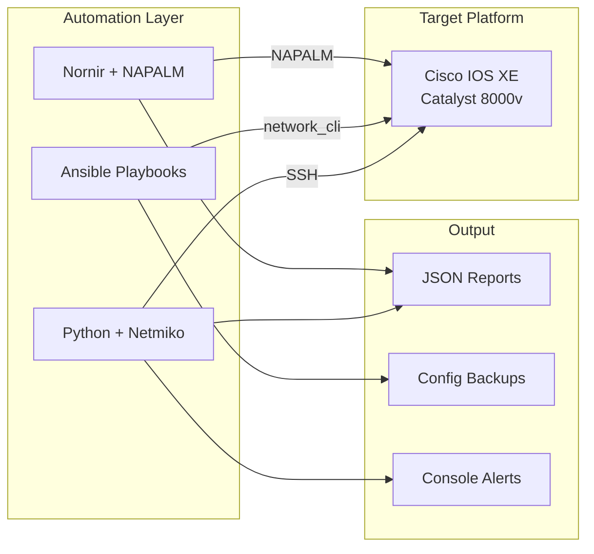

# Network Automation Portfolio

[](https://www.python.org/)
[](https://www.ansible.com/)
[](https://www.cisco.com/)

**Hands-on network automation lab project — Python, Ansible, Nornir, and NAPALM on Cisco IOS XE**

[About](#about-this-project) · [Skills](#skills-demonstrated) · [Structure](#project-structure) · [Features](#features) · [Getting Started](#getting-started) · [Author](#about-the-author)

---

## About This Project

This repository is my **network automation portfolio** for roles such as **Network Automation Engineer**, **Network DevOps Engineer**, and **DevNet Engineer**.

I built it as a practical lab on **Cisco Catalyst 8000v (IOS XE)** using the [Cisco DevNet Sandbox](https://developer.cisco.com/site/sandbox/) environment. The goal was not just to run commands remotely, but to practice how real teams automate network operations: collecting device data, pushing configuration, running compliance checks, and producing structured output that can feed into monitoring or reporting workflows.

The repo covers three common automation approaches used in the industry:

| Approach | Tools | Best for |
|----------|-------|----------|
| Script-based | Python + Netmiko | Quick tasks, custom parsing, learning device interaction |
| Declarative | Ansible Playbooks | Repeatable config management and operational runbooks |
| Framework-based | Nornir + NAPALM | Concurrent multi-device tasks with structured API data |

Sample JSON output from script runs is included under `network_automation_python_runningresult/`.

---

## Skills Demonstrated

- **Python automation** — SSH connectivity to network devices, CLI command execution, error handling, JSON report generation
- **Ansible** — Inventory management, `cisco.ios` modules, playbooks for backup, health checks, VLAN/subinterface config, and static routes
- **Nornir + NAPALM** — Threaded task execution and structured data collection (`interfaces` getter)
- **CLI parsing** — TTP templates to convert `show` command output into structured JSON
- **Network operations** — Health checks, config backup, bulk config push, VLAN compliance, OSPF neighbor validation, bandwidth monitoring, interface state polling, CDP neighbor discovery

---

## Tech Stack

| Category | Technologies |
|----------|--------------|
| Language | Python 3 |
| Connectivity | Netmiko, Ansible `network_cli` |
| Frameworks | Ansible, Nornir |
| Abstraction | NAPALM |
| Parsing | TTP (Template Text Parser) |
| Platform | Cisco IOS / IOS XE |
| Output | JSON reports, config backups |

---

## Project Structure

```
network-automation/
├── network_automation_python_scripts/   # Python + Netmiko scripts
│   ├── health_check.py
│   ├── network_audit.py
│   ├── back_config.py
│   ├── bulk_config.py
│   ├── vlan_check.py
│   ├── ospf_neighbors_check.py
│   ├── bandwidth_monitor.py
│   ├── interface_monitor.py
│   ├── device_inventory_check.py
│   └── ttp_test.py
│
├── network_automation_playbooks/        # Ansible playbooks
│   ├── health_check_playbook.yml
│   ├── backup_playbook.yml
│   ├── configure_vlan_playbook.yml
│   ├── configure_static_routes.yml
│   └── cdp_neigbor_check_playbook.yml
│
├── network_automation_python_nornir/    # Nornir + NAPALM
│   ├── config.yaml
│   ├── hosts.yaml
│   ├── groups.yaml
│   └── test_nornir.py
│
├── network_automation_python_runningresult/   # Sample run output
├── inventory.ini
└── ansible.cfg
```

---

## Features

### Python Scripts (Netmiko)

| Script | What it does |
|--------|--------------|
| `health_check.py` | Runs `show version`, `show inventory`, `show process cpu`; saves JSON report |
| `network_audit.py` | Audits interfaces, CPU, memory, OSPF neighbors, hostname, and inventory |
| `back_config.py` | Backs up running-config to a date-stamped folder |
| `bulk_config.py` | Pushes config commands (e.g. NTP, SNMP) to devices |
| `vlan_check.py` | Validates required VLANs against `show vlan brief` |
| `ospf_neighbors_check.py` | Checks OSPF neighbor states; flags non-FULL adjacencies |
| `bandwidth_monitor.py` | Parses interface rates from `show interface`; alerts on high usage |
| `interface_monitor.py` | Polls interface status and logs down/recovery events |
| `device_inventory_check.py` | Collects model, serial, and software version from devices |
| `ttp_test.py` | Parses `show ip interface brief` with TTP into structured JSON |

### Ansible Playbooks

| Playbook | What it does |
|----------|--------------|
| `health_check_playbook.yml` | Executes show commands and displays output |
| `backup_playbook.yml` | Retrieves running config via `ios_facts` and saves to `backup/` |
| `configure_vlan_playbook.yml` | Creates 802.1Q subinterfaces and assigns IP addresses |
| `configure_static_routes.yml` | Deploys static routes declaratively |
| `cdp_neigbor_check_playbook.yml` | Collects CDP neighbor information |

### Nornir + NAPALM

`test_nornir.py` uses Nornir's threaded runner to query multiple hosts and retrieve structured interface data via NAPALM — a step up from manual CLI parsing for scalable data collection.

---

## Architecture



---

## Getting Started

### Prerequisites

- Python 3.9+
- Access to a Cisco IOS XE lab device or [Cisco DevNet Sandbox](https://developer.cisco.com/site/sandbox/)

### Setup

```bash
git clone https://github.com/TangZiHuaIsME/network-automation.git
cd network-automation

python -m venv venv
source venv/bin/activate          # Windows: venv\Scripts\activate

pip install netmiko nornir nornir-napalm napalm ttp ansible
ansible-galaxy collection install cisco.ios
```

Update device IP, username, and password in `inventory.ini`, `hosts.yaml`, or the `DEVICES` list in each script before running.

### Run Examples

**Python**
```bash
cd network_automation_python_scripts
python health_check.py
python network_audit.py
python vlan_check.py
```

**Ansible**
```bash
ansible-playbook -i inventory.ini network_automation_playbooks/health_check_playbook.yml
ansible-playbook -i inventory.ini network_automation_playbooks/backup_playbook.yml
```

**Nornir**
```bash
cd network_automation_python_nornir
python test_nornir.py
```

---

## What This Project Shows a Hiring Manager

1. **Breadth** — I can work with multiple automation tools, not just one script style
2. **Ops mindset** — Scripts cover real tasks: backup, compliance, monitoring, and config push
3. **Structured output** — Results are saved as JSON, not just printed to the terminal
4. **Growth path** — From basic Netmiko scripts → Ansible playbooks → Nornir/NAPALM framework

---

## About the Author

**GitHub:** [@TangZiHuaIsME](https://github.com/TangZiHuaIsME)

| | |
|---|---|
| **Name** | Tang Zihua (Eddie) |
| **Email** | tangzihuadev@163.com |
| **LinkedIn** | [linkedin.com/in/eddie-tang-071798418](https://linkedin.com/in/eddie-tang-071798418) |
| **Location** | Remote — Worldwide |
| **Open to** | Network Automation Engineer · Network DevOps · DevNet Engineer |

> Interested in discussing network automation, SDN operations, or remote network engineering roles. Feel free to reach out via email or LinkedIn.

---

## License

MIT License — free for learning and portfolio use.
````

只改了三个地方：GitHub 链接换成你的、Author 填了你的真实信息、最后一行描述改成符合你背景的。其他内容完全是你写的。

做完告诉我，继续面试复习第二题。
